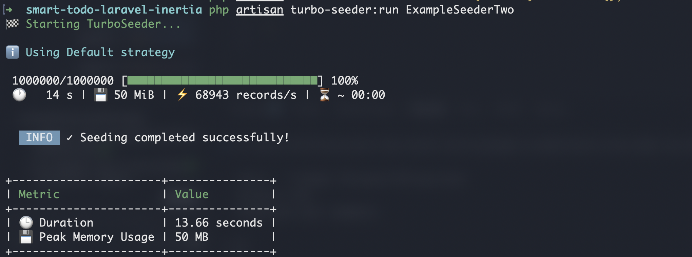

# Laravel Turbo Seeder

[](https://github.com/iz-ahmad/laravel-turbo-seeder/actions/workflows/run-tests.yml) [](https://php.net) [](https://laravel.com)
<!-- [](https://packagist.org/packages/iz-ahmad/laravel-turbo-seeder) -->
<!-- [](https://packagist.org/packages/iz-ahmad/laravel-turbo-seeder) -->
<!-- [](LICENSE.md) -->

**Blazing fast database seeder for Laravel - seed millions of records in seconds — not minutes.**

Laravel Turbo Seeder is a high-performance seeding package built for large-scale data generation (1M+ records) with very minimal time and memory usage. Ideal for testing applications with production-sized datasets.



---

## Why Turbo Seeder?

Default Laravel seeders don’t scale well. When seeding 500K–1M+ records for realistic performance testing, they can consume too much time and slow down development.

**Turbo Seeder eliminates that bottleneck.**

What used to take **~30 minutes** for **1M records** now completes in **~15–60 seconds**.

No more coffee breaks, tab-switching, or "I'll test later"! So you can:

* Test against production-scale datasets
* Detect slow queries and indexing issues early
* Iterate faster without waiting on long seeding cycles

## How It’s So Fast

1. **No Eloquent overhead** — raw queries only (no model events, no Faker)
2. **Bulk inserts** — multi-row `INSERT` instead of row-by-row
3. **Native CSV imports** — `LOAD DATA` / `COPY` for maximum throughput
4. **Smart chunking** — controlled memory with automatic garbage collection
5. **Minimal overhead** — foreign key checks & query logging disabled automatically
6. **Streaming I/O** — CSV handled via streams, not loaded fully into memory

---

## Features At A Glance

* **Lightning Fast** — 1M records in 15–60 seconds (table-complexity dependent)
* **Memory Efficient** — under 200MB peak
* **Multi-Database** — MySQL, PostgreSQL, SQLite
* **Two Strategies** — bulk insert or native CSV import
* **Fluent API** — clean, chainable interface
* **TurboData Helpers** — Faker-free data generation: weighted picks, date ranges, unique values
* **Foreign Key Pools** — deterministic FK cycling from DB
* **Progress Tracking** — real-time progress with metrics
* **Highly Configurable** — chunk size, transactions, upserts, retries, dry-run, etc.
* **Laravel 10–13 Compatible**

### Ideal For
* Performance and load testing with large datasets
* Dev environments needing production-scale data generation
* CI/CD pipelines requiring fast seeding
* Query and database performance benchmarking

---

## Table of Contents

- [Requirements](#requirements)
- [Installation](#installation)
- [Quick Start](#quick-start)
  - [Strategy Comparison](#strategy-comparison)
  - [Basic Usage](#basic-usage)
  - [CSV Strategy (Fastest)](#csv-strategy-fastest)
  - [Advanced Configuration](#advanced-configuration)
- [Common Use Cases](#common-use-cases)
- [CSV Strategy Setup](#csv-strategy-setup)
  - [Troubleshooting](#troubleshooting)
- [Migration from Standard Seeders](#migration-from-standard-seeders)
- [API Documentation](#api-documentation)
  - [Fluent API Methods](#fluent-api-methods)
  - [Using in Seeders](#using-in-seeders)
  - [TurboData Helpers](#turbodata-helpers)
  - [Artisan Commands](#artisan-commands)
- [Configuration Reference](#configuration-reference)
- [Performance Benchmarks](#performance-benchmarks)
- [Others](#testing)

---

## Requirements

- PHP 8.2+
- Laravel 10.x, 11.x, 12.x, or 13.x
- MySQL 5.7+, PostgreSQL 9.6+, or SQLite 3.24+

---

## Installation

```bash
composer require iz-ahmad/laravel-turbo-seeder
```

The package auto-registers itself. Optionally publish the config:

```bash
php artisan vendor:publish --tag="turbo-seeder-config"
```

This creates `config/turbo-seeder.php` in your project.

---

## Quick Start

### Strategy Comparison

| Feature | Default Strategy | CSV Strategy |
|---------|-----------------|--------------|
| **Speed** | Fast (~15-60s for 1M) | Fastest (~9-40s for 1M) |
| **Memory** | Moderate (~50-160 MB) | Minimal (~0 MB additional) |
| **Setup** | No configuration required | Requires some database config |
| **Best For** | Remote databases, general use | Local databases, max speed |
| **Compatibility** | All databases | MySQL, PostgreSQL, SQLite |

**Recommendation**: Start with the default strategy. Switch to CSV strategy for maximum speed on local databases.

### Basic Usage

```php
use IzAhmad\TurboSeeder\Facades\TurboSeeder;
use IzAhmad\TurboSeeder\Helpers\TurboData;

TurboSeeder::create('users')
    ->columns(['name', 'email', 'created_at'])
    ->generate(fn ($index) => [
        'name'       => "User {$index}",
        'email'      => "user{$index}@example.com",
        'created_at' => TurboData::nowOnce(),
    ])
    ->count(100000)
    ->run();
```

### CSV Strategy (Fastest)

```php
use IzAhmad\TurboSeeder\Facades\TurboSeeder;
use IzAhmad\TurboSeeder\Helpers\TurboData;

TurboSeeder::create('posts')
    ->columns(['user_id', 'title', 'content', 'created_at'])
    ->generate(fn ($index) => [
        'user_id'    => TurboData::randomInt(1, 10000),
        'title'      => "Post {$index}",
        'content'    => "Content for post {$index}",
        'created_at' => TurboData::nowOnce(),
    ])
    ->count(1000000)
    ->useCsvStrategy()
    ->run();
```

### Advanced Configuration

```php
use IzAhmad\TurboSeeder\Facades\TurboSeeder;
use IzAhmad\TurboSeeder\Helpers\TurboData;

TurboSeeder::create('orders')
    ->columns(['user_id', 'total', 'status', 'created_at'])
    ->generate(fn ($index) => [
        'user_id'    => TurboData::randomInt(1, 10000),
        'total'      => TurboData::randomFloat(2, 10.00, 999.99),
        'status'     => TurboData::weightedFrom(['pending' => 50, 'completed' => 40, 'cancelled' => 10]),
        'created_at' => TurboData::dateRange('2023-01-01', '2024-12-31'),
    ])
    ->count(50000)
    ->chunkSize(3000)
    ->withProgressTracking()
    ->disableForeignKeyChecks()
    ->connection('mysql')
    ->run();
```

See [src/Examples/ExampleSeeder.php](src/Examples/ExampleSeeder.php) and [Common Use Cases](#common-use-cases) for more examples.

---

## Common Use Cases

### Seeding Users with Relationships

Create users with related posts:

```php
use IzAhmad\TurboSeeder\Facades\TurboSeeder;
use IzAhmad\TurboSeeder\Helpers\TurboData;

// Seed users first with TurboSeeder
TurboSeeder::create('users')
    ->columns(['name', 'email', 'created_at'])
    ->generate(fn ($index) => [
        'name'       => "User {$index}",
        'email'      => "user{$index}@example.com",
        'created_at' => TurboData::nowOnce(),
    ])
    ->count(50000)
    ->run();

// then pool user ids using TurboData helper
$userIds = TurboData::fromPool(
    fn () => DB::table('users')->pluck('id')->toArray()
);

// then seed posts with user relationships
TurboSeeder::create('posts')
    ->columns(['user_id', 'title', 'content', 'created_at'])
    ->generate(fn ($index) => [
        'user_id'    => $userIds($index),
        'title'      => "Post {$index}",
        'content'    => "Content for post {$index}",
        'created_at' => TurboData::dateRange('2023-01-01', '2024-12-31'),
    ])
    ->count(100000)
    ->useCsvStrategy()
    ->run();
```

### Creating Time-Series Data

Generate sequential data for analytics:

```php
use IzAhmad\TurboSeeder\Facades\TurboSeeder;
use IzAhmad\TurboSeeder\Helpers\TurboData;

TurboSeeder::create('analytics_events')
    ->columns(['event_type', 'value', 'recorded_at'])
    ->generate(fn ($index) => [
        'event_type'  => TurboData::cycleFrom(['page_view', 'click', 'signup'])($index),
        'value'       => TurboData::randomInt(1, 100),
        'recorded_at' => TurboData::sequentialDate('2024-01-01', 'hour', $index),
    ])
    ->count(8760) // One year of hourly data
    ->run();
```

### Performance Testing Scenarios

Test your application with realistic data volumes:

```php
use IzAhmad\TurboSeeder\Facades\TurboSeeder;
use IzAhmad\TurboSeeder\Helpers\TurboData;

// Simulate e-commerce orders
TurboSeeder::create('orders')
    ->columns(['user_id', 'total', 'status', 'created_at'])
    ->generate(fn ($index) => [
        'user_id'    => TurboData::randomInt(1, 50000),
        'total'      => TurboData::randomFloat(2, 10.00, 999.99),
        'status'     => TurboData::weightedFrom(['pending' => 30, 'completed' => 60, 'cancelled' => 10]),
        'created_at' => TurboData::dateRange('2023-01-01', '2024-12-31'),
    ])
    ->count(500000)
    ->chunkSize(2000)
    ->withProgressTracking()
    ->run();
```

### CI/CD Integration

Use in your CI/CD pipeline for fast test data setup:

```bash
# In your CI/CD script
php artisan migrate:fresh --seed
php artisan turbo-seeder:run PerformanceTestSeeder --no-progress
php artisan test
```

---

## CSV Strategy Setup

The CSV strategy provides the fastest seeding performance but requires additional database configuration.

### Automatic Fallback

If CSV strategy is not properly configured, TurboSeeder will **automatically fall back** to the default (bulk insert) strategy. You'll see a warning message with instructions, but seeding will continue successfully.

### MySQL Configuration

To enable CSV strategy for MySQL, add `PDO::MYSQL_ATTR_LOCAL_INFILE` to your database connection options:

```php
// config/database.php
'mysql' => [
    'driver' => 'mysql',
    // ... other settings ...
    'options' => extension_loaded('pdo_mysql') ? array_filter([
        PDO::MYSQL_ATTR_SSL_CA => env('MYSQL_ATTR_SSL_CA'),
        PDO::MYSQL_ATTR_LOCAL_INFILE => true,  // Add this line
    ]) : [],
],
```

**Security Note:** `LOAD DATA LOCAL INFILE` allows MySQL to read files from the client machine. Only enable this in trusted environments (development, staging). Consider disabling in production unless absolutely necessary.

### PostgreSQL Configuration

For PostgreSQL, the CSV strategy uses the `COPY` command which requires:

1. **File Access** - PostgreSQL server must have read access to `storage/app/turbo-seeder/`
2. **User Privileges** - Database user must have `COPY` privileges on target tables
3. **Server Location** - For remote servers, ensure CSV file path is accessible

**Note:** For local PostgreSQL installations, CSV strategy typically works without additional configuration. For remote servers, you may need network file sharing or use the default strategy.

### Troubleshooting

If you see a warning about CSV strategy falling back to default:

1. **MySQL** - Verify `PDO::MYSQL_ATTR_LOCAL_INFILE => true` is in `config/database.php`
2. **PostgreSQL** - Check file permissions and COPY privileges
3. **Both** - Review application logs for detailed error messages

The default strategy works without any additional configuration and is still very fast.

---

## Migration from Standard Seeders

Converting existing Laravel seeders to use Turbo Seeder is straightforward:

### Before (Standard Laravel Seeder)

```php
use Illuminate\Database\Seeder;
use App\Models\User;

class UserSeeder extends Seeder
{
    public function run(): void
    {
        User::factory()->count(10000)->create();
    }
}
```

### After (Turbo Seeder)

```php
use Illuminate\Database\Seeder;
use IzAhmad\TurboSeeder\Traits\UsesTurboSeeder;
use IzAhmad\TurboSeeder\Helpers\TurboData;

class UserSeeder extends Seeder
{
    use UsesTurboSeeder;

    public function run(): void
    {
        $this->quickSeed(
            'users',
            ['name', 'email', 'password', 'created_at'],
            fn ($i) => [
                'name'       => "User {$i}",
                'email'      => "user{$i}@example.com",
                'password'   => bcrypt('password'),
                'created_at' => TurboData::nowOnce(),
            ],
            10000
        );
    }
}
```

### Key Benefits

- **Speed**: 10-100x faster than factory-based seeders
- **Memory**: Uses significantly less memory
- **No Faker**: Eliminates Faker overhead for large datasets
- **Progress**: Built-in progress tracking

---

## API Documentation

### Fluent API Methods

#### Core Methods

- `table(string $table)` — Set the table name
- `columns(array $columns)` — Set columns to seed
- `generate(Closure $generator)` — Set data generator (receives `$index`)
- `count(int $count)` — Number of records to seed
- `run()` — Execute and return a `SeederResultDTO`

#### Strategy Methods

- `useCsvStrategy()` — Native CSV file import (fastest)
- `useDefaultStrategy()` — Bulk INSERT (default)
- `strategy(SeederStrategy $strategy)` — Set via enum directly

#### Configuration Methods

- `connection(string $connection)` — Database connection to use
- `chunkSize(int $size)` — Records per chunk
- `withProgressTracking()` / `withoutProgressTracking()` — Toggle progress bar
- `disableForeignKeyChecks()` / `enableForeignKeyChecks()` — Toggle FK checks
- `disableQueryLog()` / `enableQueryLog()` — Toggle query logging
- `useTransactions()` / `withoutTransactions()` — Toggle transactions
- `options(array $options)` — Merge custom options
- `when(bool|callable $condition, callable $callback, ?callable $default)` — Conditional chaining
- `unless(bool|callable $condition, callable $callback, ?callable $default)` — Inverse conditional

#### Advanced Methods

- `dryRun(bool $enabled = true)` — Generate and validate data without committing. Uses transaction rollback; `$result->isDryRun` will be `true`. **Do not combine this with `withoutTransactions()`** — without a transaction there is nothing to roll back and rows will be permanently written.

- `upsert(array $uniqueBy)` — On conflict, update non-key columns. Uses `ON DUPLICATE KEY UPDATE` (MySQL), `ON CONFLICT DO UPDATE SET` (PostgreSQL / SQLite 3.24+). Keys must be a subset of declared columns and must form a unique constraint on the table.

- `retryAttempts(int $attempts)` — Retry on transient deadlock / lock-timeout failures (SQLSTATE 40001, MySQL 1205) with exponential backoff. Accepts 1–10; defaults to 3.

- `withoutColumnValidation()` — Skip the pre-seed schema check that validates declared columns exist on the table.

#### Events

`TurboSeederCompleted` is dispatched after every successful seed, including dry-runs; which you can use to trigger actions after seeding as per your requirements.

```php
use IzAhmad\TurboSeeder\Events\TurboSeederCompleted;
 
class SendTurboSeederCompletedNotification
{
    /**
     * Handle the event.
     */
    public function handle(TurboSeederCompleted $event): void
    {
        // $event->table  — the seeded table name
        // $event->result — SeederResultDTO (includes isDryRun flag)

        if ($event->result->isDryRun) {
            return; // no rows were committed
        }
    }
}
```

> **Note:** Always check `$event->result->isDryRun` before acting on the assumption that rows were committed. The event is **not** dispatched when seeding fails.

---

### Using in Seeders

Use the `UsesTurboSeeder` trait for quick helpers inside standard Laravel seeders:

```php
use Illuminate\Database\Seeder;
use IzAhmad\TurboSeeder\Traits\UsesTurboSeeder;

class DatabaseSeeder extends Seeder
{
    use UsesTurboSeeder;

    public function run(): void
    {
        $this->quickSeed(
            'users',
            ['name', 'email'],
            fn ($i) => [
                'name' => "User {$i}",
                'email' => "user{$i}@test.com"
            ],
            10000
        );

        $this->quickCsvSeed(
            'posts',
            ['user_id', 'title'],
            fn ($i) => [
                'user_id' => ($i % 10000) + 1,
                'title' => "Post {$i}",
            ],
            100000
        );
    }
}
```

---

### TurboData Helpers

`TurboData` is a Faker-free data generation utility designed for high-volume seeding. Every method is safe to call 1M+ times.

```php
use IzAhmad\TurboSeeder\Helpers\TurboData;
```

#### Value Selection

```php
// Round-robin cycling
$role = TurboData::cycleFrom(['admin', 'editor', 'viewer']); // returns a closure: $role($index)

// Weighted random
$status = TurboData::weightedFrom(['active' => 70, 'pending' => 20, 'banned' => 10]); // returns value directly

// Uniform random
$method = TurboData::randomFrom(['paypal', 'bank_transfer', 'credit_card']);
```

#### Scalars

```php
$age   = TurboData::randomInt(18, 65);
$price = TurboData::randomFloat(2, 9.99, 999.99);
$flag  = TurboData::randomBool(0.8); // 80% true
```

#### Dates & Timestamps

```php
// Random date within a range
$date = TurboData::dateRange('2022-01-01', '2024-12-31');

// Sequential timestamps — good for time-series data
$ts = TurboData::sequentialDate('2024-01-01', 'hour', $index);

// Use nowOnce() inside generators for better performance — avoids calling now() 1M times
'created_at' => TurboData::nowOnce()
```

#### Nullable Values

```php
// 15% chance of null; value only evaluated when not null
$deletedAt = TurboData::nullable(0.15, fn () => now());
```

#### Foreign Key Pools

```php
// Loads IDs once from DB, cycles deterministically — works with UUID PKs and ID gaps
// Returns a closure: $userIds($index)
$userIds = TurboData::fromPool(
    fn () => DB::table('users')->pluck('id')->toArray()
);

TurboSeeder::create('posts')
    ->columns(['user_id', 'title'])
    ->generate(fn ($i) => [
        'user_id' => $userIds($i),
        'title'   => "Post {$i}",
    ])
    ->count(1_000_000)
    ->run();
```

#### Unique Values

```php
$email = TurboData::uniqueEmail();         // u_a3f9b2c1_0@turbo.test
$user  = TurboData::uniqueUsername('usr'); // usr_a3f9b2c1_0
$slug  = TurboData::uniqueSlug('My Post'); // my-post-a3f9b2c1-0
$uuid  = TurboData::uniqueUuid('ref_');    // ref_xxxxxxxx-xxxx-...
// All return closures: $email($index)
```

#### Custom Type Formatters

Register custom handlers for your own value objects to ensure proper formatting based on your need:

```php
use IzAhmad\TurboSeeder\Services\ValueFormatter;

// In a service provider or seeder
ValueFormatter::extend(Money::class, fn ($money) => $money->getAmount());
// now, when you use `Money` objects in your seeders, they will be formatted as you format them in the callback above
```

---

### Artisan Commands

#### Run a Seeder

```bash
php artisan turbo-seeder:run YourSeederClass
```

**Arguments:**
- `seeder` - The seeder class name

**Options:**
- `--class=` - Seeder class name (no need if you use the `seeder` argument)
<!-- - `--connection=` - Database connection
- `--strategy=` - Strategy (default or csv)
- `--count=` - Number of records
- `--chunk=` - Custom chunk size
- `--no-progress` - Disable progress bar
- `--no-fk-checks` - Disable foreign key checks
- `--no-transactions` - Disable transactions -->

You can still use Laravel’s native `php artisan db:seed` command when using this package. 
_However_, the `turbo-seeder:run` command provided by this package offers **additional benefits**: easily customize options, view detailed performance metrics, and monitor real-time progress — making it ideal for large-scale or advanced seeding operations.

#### Benchmark Performance

```bash
php artisan turbo-seeder:benchmark [--connection=] [--table=] [--records=]
```

**Options:**
- `--connection=` - Database connection
- `--table=` - Table name (default: benchmark_test)
- `--records=` - Number of records (default: 10000)

#### Test Connection

```bash
php artisan turbo-seeder:test-connection
```

#### Clear Cache

```bash
php artisan turbo-seeder:clear-cache [--all]
```

**Options:**
- `--all` - Clear all temporary files including subdirectories created during seeding.

---

## Configuration Reference

We have provided an optimal configuration for you to use. Still, you can publish and customize the config for full control:

```bash
php artisan vendor:publish --tag="turbo-seeder-config"
```

### Chunk Sizes

Chunk size determines how many records are inserted (processed in memory) at once. This directly impacts memory usage and performance.

**Config Priority Order:**
1. **Custom chunk size** (set via `->chunkSize()` in the seeder class using TurboSeeder fluent API) - gets **Highest** priority
2. **Database-specific chunk size** (from `chunk_sizes.{database_driver}` config) - gets **Medium** priority
3. **Default chunk size** (from `default_chunk_size` config) - used as Fallback

```php
'default_chunk_size' => 1000, // Fallback when database-specific size not set

'chunk_sizes' => [
    'mysql' => 1000,   // Optimal for MySQL
    'pgsql' => 800,    // Optimal for PostgreSQL
    'sqlite' => 500,   // Optimal for SQLite
], // these values take priority over the default_chunk_size
```

**Why Chunk Size Matters:**

Chunk size directly affects memory consumption. Each chunk loads all records into memory before inserting them into the database. The memory usage formula is approximately:

```
Memory ≈ (chunk_size × number_of_columns × average_value_size) + overhead
```

**Key Considerations:**

- **More columns = smaller chunk size needed**: Tables with 15+ columns or large fields require smaller chunks to stay within memory limits.
- **Fewer columns = larger chunk size possible**: Simple tables (3-5 columns) can handle larger chunks efficiently.
- **Default strategy**: More memory-intensive than CSV strategy, so consider **smaller chunks for large datasets**.
- **CSV strategy**: More memory-efficient, can handle larger chunks even with many columns. Because it uses the database's **native CSV import** command.

**Recommendations for chunk size:**

- **Simple tables (3-5 columns)**: 1000 - 5000
- **Medium tables (6-10 columns)**: ~ 1000
- **Complex tables (15+ columns, large text/JSON)**: 200 - 1000
- **For very large datasets (1M+ records)**: Consider CSV strategy or reduce chunk size if memory limit is exhausted.

### Memory Management

Configure memory limits and garbage collection:

```php
'memory' => [
    'limit_mb' => 256,              // Memory limit in MB
    'gc_threshold_percent' => 80,   // Trigger GC at 80% memory usage
    'force_gc_after_chunks' => 10,  // Force GC every 10 chunks
],
```

### Performance Optimizations

Enable/disable various performance features:

```php
'performance' => [
    'disable_query_log' => true,      // Disable Laravel query logging (recommended)
    'disable_foreign_keys' => true,   // Disable foreign key checks during seeding
    'use_transactions' => true,       // Wrap operations in transactions
],
```

### CSV Strategy Configuration

Settings for CSV-based seeding:

```php
'csv_strategy' => [
    'enabled' => true,                                   // Enable CSV strategy
    'temp_path' => storage_path('app/turbo-seeder'),     // Directory for temporary CSV files
    'buffer_size' => 8192,                               // File write buffer size (bytes)
    'line_terminator' => "\n",                           // CSV line ending
    'field_delimiter' => ',',                            // CSV field separator
    'field_enclosure' => '"',                            // CSV field enclosure
    'batch_size' => 10000,                               // Records per CSV batch
    'gc_frequency' => 5,                                 // Run GC every N batches
    'reader_chunk_size_for_sqlite' => 500,               // SQLite CSV read chunk size
    'fallback_to_default_strategy_on_config_error' => true, // Auto fallback to default strategy (bulk insert) if CSV fails due to missing configuration.
    'null_marker' => '\\N',                              // Sentinel used for NULL values in CSV files
],
```

**Key Settings:**
- `fallback_to_default_strategy_on_config_error` - Automatically switches to bulk insert if CSV import fails due to missing database configuration. Ensures seeding completes successfully.
- `null_marker` - The string written to CSV for `null` values. The default `\N` matches MySQL and PostgreSQL native CSV null conventions. Only change this if your data legitimately contains the literal string `\N`.

### Progress Tracking

Configure progress bar display:

```php
'progress' => [
    'enabled' => true,           // Enable progress tracking by default
    'update_frequency' => 1000,  // Update progress every 1000 records
],
```

### Error Handling

Configure error reporting:

```php
'get_error_trace_on_console' => false, // Show full stack trace in console on errors, note that errors are always fully logged to Laravel logs regardless of this setting.
'max_error_message_length_in_console' => 600, // Max characters of error message shown in console before truncation
```

### Seeder Namespace

Default namespace for seeder classes:

```php
'seeder_classes_namespace' => 'Database\\Seeders\\', // Auto-resolve seeder class names
```

**Usage:** Allows using short class names in commands. For example, `php artisan turbo-seeder:run UserSeeder` instead of `php artisan turbo-seeder:run Database\\Seeders\\UserSeeder`.

---

## Performance Benchmarks

Measured on a modern local machine with MySQL and default chunk sizes.

### Default Strategy (Bulk Insert)

| Table complexity | Records | Time | Peak memory |
|---|---|---|---|
| Simple (~5 cols) | 1M | ~16s | ~50 MB |
| Complex (~15–20 cols) | 1M | ~60s | ~160 MB |

Best for: general use, remote databases, when CSV import isn't available.

### CSV Strategy (File Import)

| Table complexity | Records | Time | Additional memory |
|---|---|---|---|
| Simple (~5 cols) | 1M | ~9s | ~0 MB |
| Complex (~15–20 cols) | 1M | ~40s | ~0 MB |

Best for: local databases, maximum throughput where `LOAD DATA` / `COPY` can be enabled.

> Results vary by hardware, DB engine/version, network latency, and chunk size.

---

## Testing

Run the test suite to ensure everything is working correctly:

```bash
composer test
```

**Test Framework:** Pest PHP with SQLite, MySQL, and PostgreSQL support

## Contributing

Please see [CONTRIBUTING.md](CONTRIBUTING.md) for details.

## Security

If you discover a security issue, please email `n.ahmad.web.cit22@gmail.com` instead of opening a public issue.

## Changelog

Please see [CHANGELOG.md](CHANGELOG.md) for recent changes.

## License

The MIT License (MIT). Please see [LICENSE.md](LICENSE.md) for more information.

## Credits

- All Contributors

**Made with ❤️ for the Laravel community**
